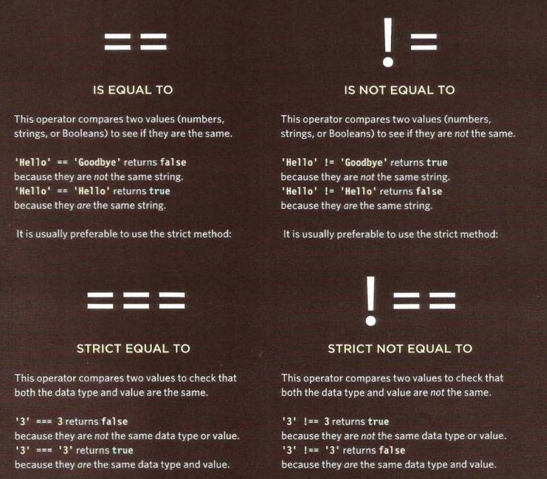
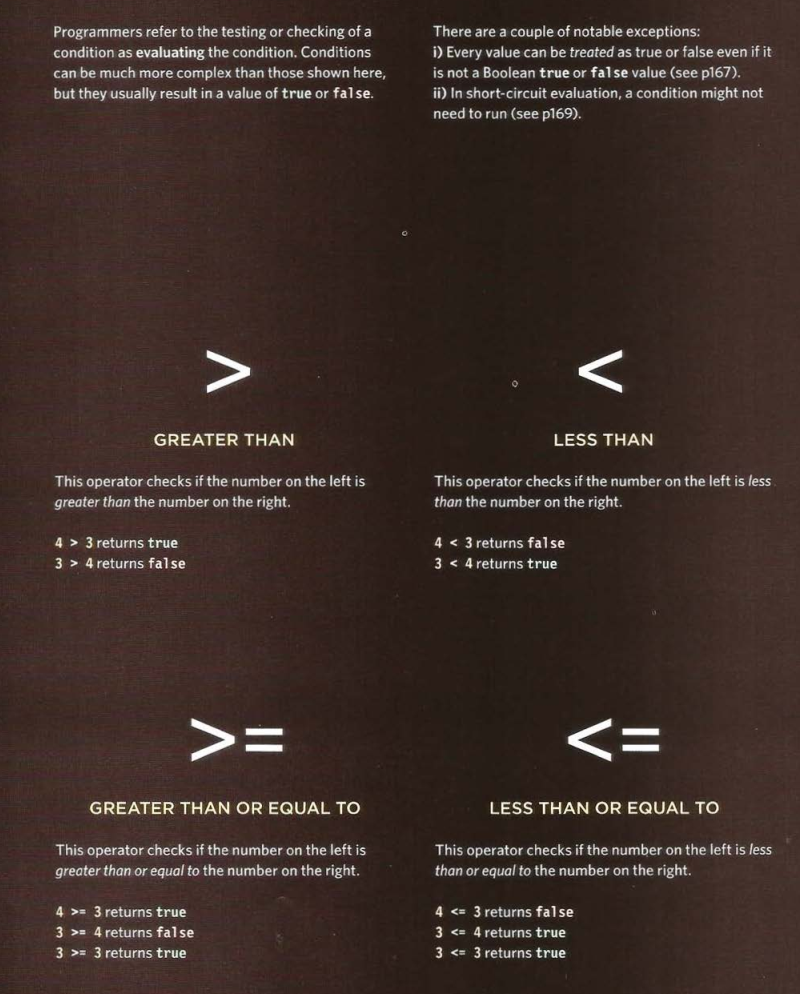
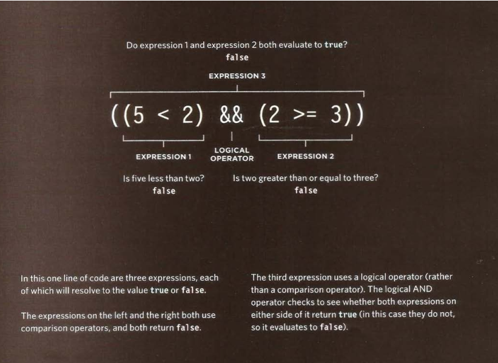
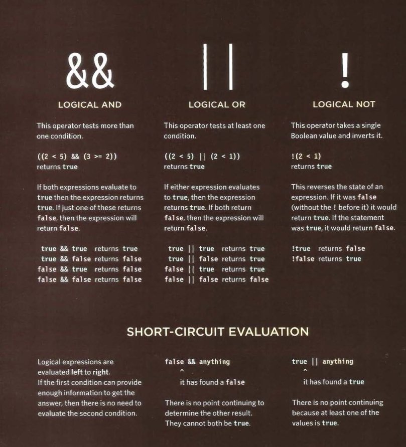
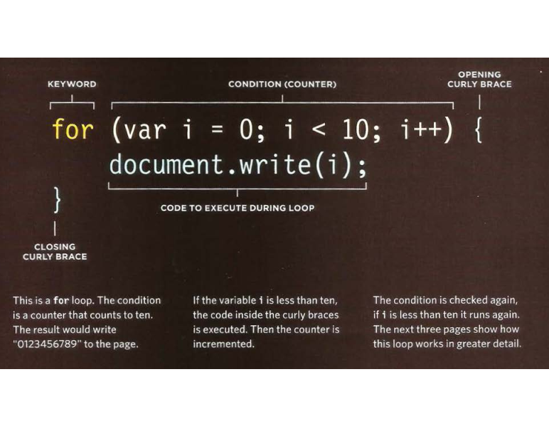
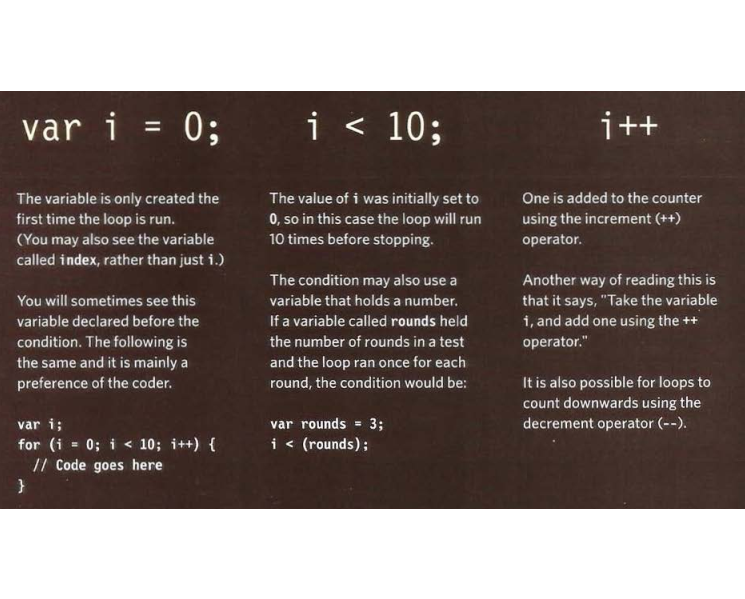
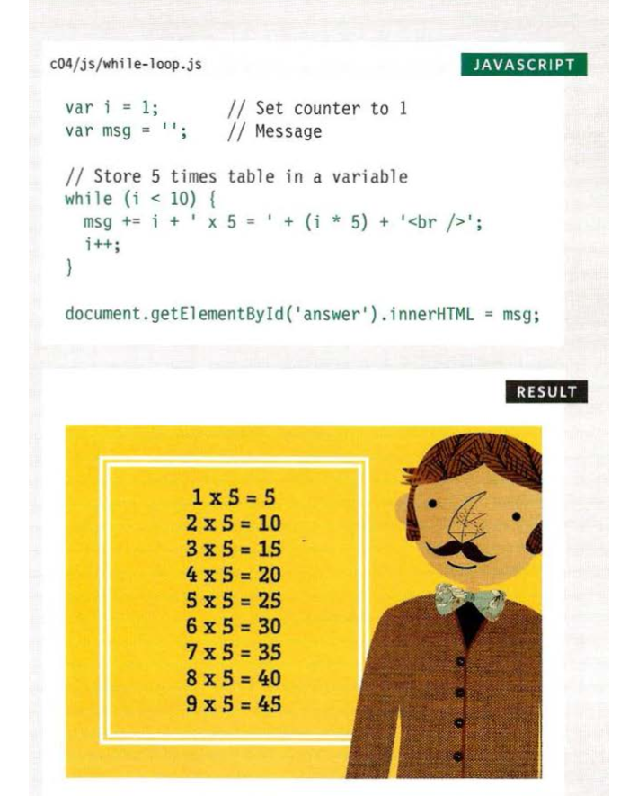

# Comparison operators : evaluting condition

- you can evaluate a situation by comparing on value in the script to what you expect it might be , the result will be  a boolean : true or false . 

 

## Logical operators 
- comparison operators usually return single values of true or false .
- logical operators allow you to compare the results  of more than one comparison operator . 

## LOOPS 
- loops check a condition if it return true , a code block will run .
- Then the condition will be checked again and if it still return ture , the code block will run again .
- It repeats until the condition returns false 

#### there are three types of loops :
1. FOR 
- we used it for run a code a specific number of times  
- In a for loop the condition is usually a counter which is used to tell how many times the loop should run .
2. WHILE
-  we use it when we don't know ho many times the code should run 
- the code will continue to loop for as long as the condition is ture .
3. DO WHILE
- is the same WHILE loop but it will always run the statment inside the curly braces at least once , even if the condition evaluates to false . 

## LOOP COUNTER 
- A for loop uses  a counter as a condition 
- this instructs the code to run a specified number of times .
#### The condition is made up of three statment :
1. initialization 
- create a variable and set it to 0 
- this variable is commonly called i , and it acts as the counter 
2. condition 
- the loop should continue to run until the counter reaches a specified number .
3. update 
- every time  the loop has run the statement in the curly braces , it adds one to the counter .

### using while loop 
 !
- The first statement uses the+=
operator, which is used to add
new content to the msg variable.
Each time the loop runs, a new
calculation and line break is
added to the end of the message
being stored in it. So+" works as
a shorthand for writing:
msg = msg + 'new msg'
(See bottom of the next page for
a breakdown of this statement.)

- The second statement
increments the counter variable
by one. (This is done inside
the loop rather than with the
condition.)
- When the loop has finished, the
interpreter goes to the next line
of code, which writes the msg
variable to the page.

